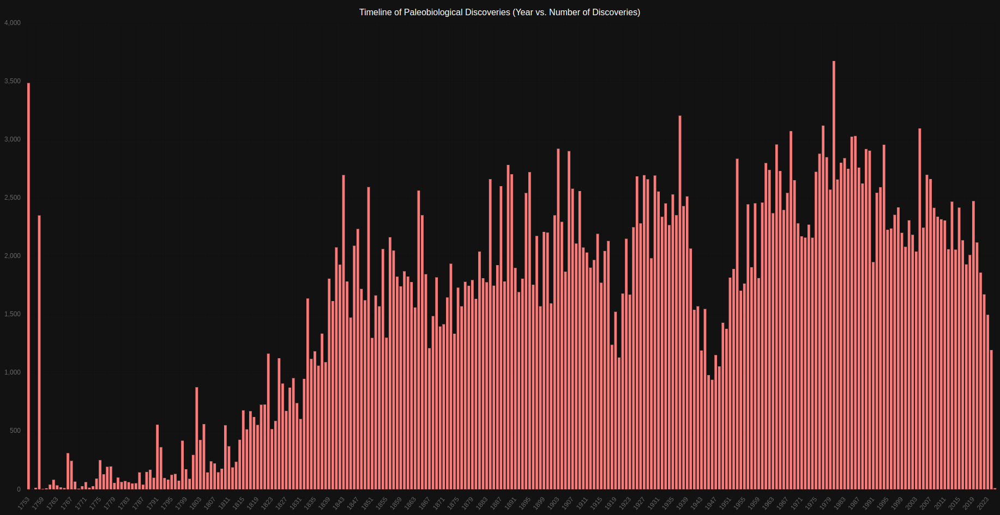

# Paleobiovue

## Introduction
Paleobiovue was written for learning purposes, exemplfying a web application framework for interacting with the Paleobiology Database (PBDB), a  resource that collates occurrence and taxonomic data for life forms across various geological eras. This application serves as a tool for researchers and developers to efficiently access, process, and visualize paleontological data.

Created by the Encyclopedia of Life, PBDB aims to integrate large multidisciplinary datasets into a single database accessible at [paleobiodb.org](http://paleobiodb.org/). The data is offered under a Creative Commons Attribution 4.0 International license.

## Getting Started

### Data Preparation
Start by downloading the necessary data from the PBDB. Retain the `taxon.tab` file, which contains taxonomic information. Use the `split_taxon.py` script to split this file into smaller parts, or employ the pre-split files `taxon_part1.tab` and `taxon_part2.tab` included in the repository: `Version v710.5281/zenodo.14829528`.

### Application Overview

#### API Component
- **Framework**: The API is structured using Flask, facilitated by Flask CORS to manage cross-origin requests
- **Database**: Employs MongoDB, interacting through `pymongo` and configured via environment variables
- **Functionality**: Supports data ingestion that transforms tabular data into structured MongoDB documents
- **Initial Data Load**: Utilize the `load_initial_data` function, employing the `insert_taxon` module, ensuring up-to-date taxonomic records

#### Node Modules and Dependencies
- **Dependencies**: Contains root and subdirectory `node_modules` managed via `package.json` for both API and UI functionalities
- **Build Tools**: Employ `babel`, `webpack`, and `PostCSS`

#### Docker and Containerization
- **Docker Setup**: Implement Dockerfiles and `docker-compose.yml`
- **Environments**: Define API, UI, and MongoDB services
- **MongoDB**: Includes authentication and initialization scripts

#### UI Component
- **Framework**: Built with Vue.js
- **Communication**: Fetches data from API via environment-configured URLs
- **Development and Build**: Pre-configured using Vue CLI project structure